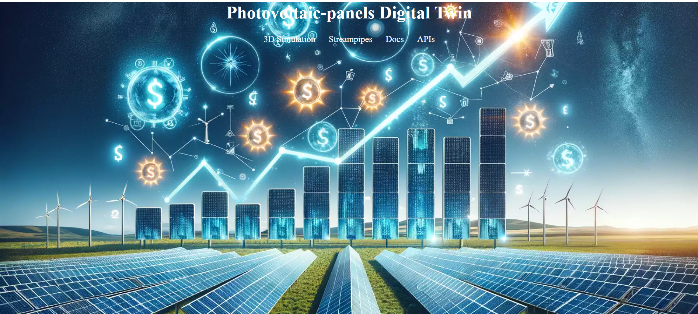

# A Digital Twin Framework for PV Panels

This repository contains the source code developed for the academic study titled **"A Digital Twin Framework for PV Panels"**, submitted to **WCNC 2025 WS09: TwinNetApp: Data Driven and AI-Enabled Digital Twin Networks and Applications**.

## 📊 Overview
This project aims to establish a comprehensive digital twin framework for photovoltaic (PV) panels, integrating real-time data processing, mathematical modeling, and 3D simulations. The implementation includes machine learning models for predictive analytics, service-oriented architectures for the digital twin, and real-time data streaming solutions.

## 🗂️ Project Structure

```
├── analytics/            # Machine learning model development
├── services/             # Microservices for the digital twin application
├────── modelling/            # Backend models and API services (FastAPI)
├────── 3dsimulation/         # Unity WebGL build for 3D simulation
├────── docker-compose.yml    # Docker configuration for multi-container setup
└── README.md             # Project documentation
```
## 🚀 Key Technologies
- **Machine Learning:** Python, Scikit-learn, Keras, River  (analytics/)
- **Digital Twin Models:** FastAPI, Unity WebGL (services/modelling)
- **3D Simulations:** Unity WebGL (services/3dsimulation/)
- **Real-Time Data Processing:** [Apache Streampipes](https://streampipes.apache.org/docs/try-installation/)
- **Containerization:** Docker, Docker Compose

## 📦 External Resources
- **Unity 3D Models:**
  - [Factory District](https://assetstore.unity.com/packages/3d/environments/factory-district-78107)
  - [High-Quality Solar Panel](https://assetstore.unity.com/packages/3d/props/industrial/high-quality-solar-panel-175231)
- **Mathematical Model:** [PhotoVoltaics](https://github.com/christiankral/PhotoVoltaics)
- **Dataset:** [Photovoltaic Panels Energy Prediction](https://github.com/rosameo/Photovoltaic-panels-energy-prediction)

## ⚙️ Setup Instructions
1. **Clone the Repository:**
   ```bash
   git clone https://github.com/Cygnus-Team/A-Digital-Twin-Framework-for-PV-Panels.git
   cd services
   ```
2. **Build and Run with Docker Compose:**
   ```bash
   docker-compose up --build
   ```
3. **Access the Services:**
   - FastAPI backend: [http://localhost:8000](http://localhost:8000)
   - Unity WebGL simulation: [http://localhost:8001](http://localhost:8001)
   - Streampipes (If Installed): [http://localhost/#/login](http://localhost/#/login)

## 📧 Contact
For further details or collaboration inquiries, please contact:

- **Research Team:** [Cygnus-Team]
- **Github:** https://github.com/Cygnus-Team

---
*This project is part of the submission to WCNC 2025 WS09: TwinNetApp.*

